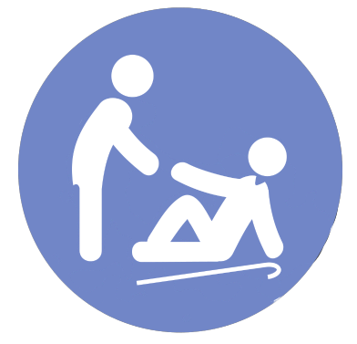
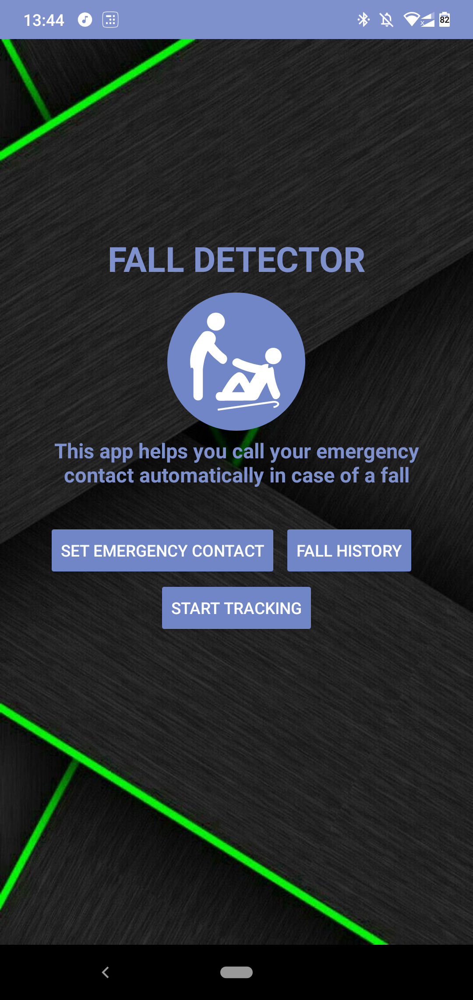
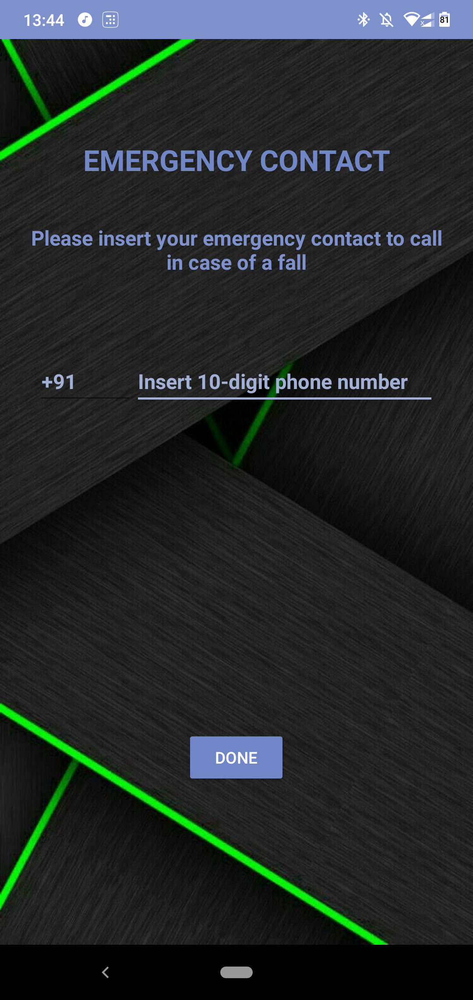
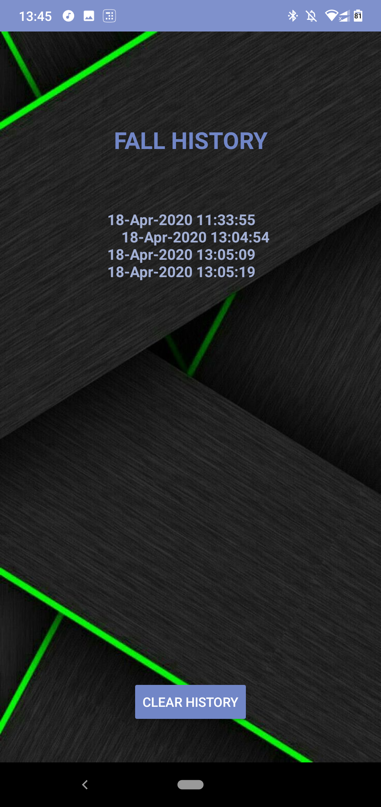
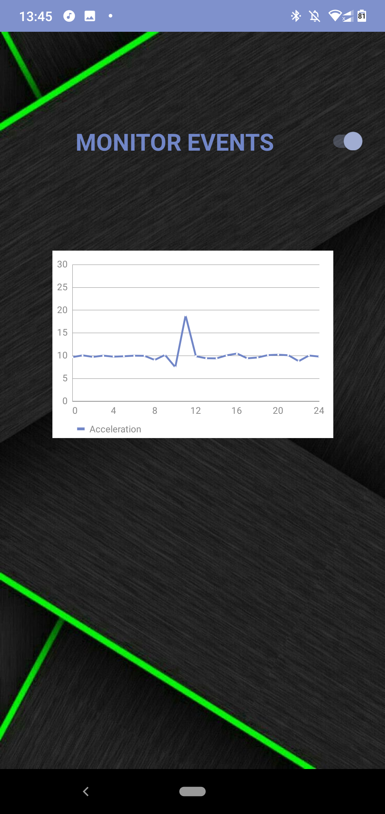
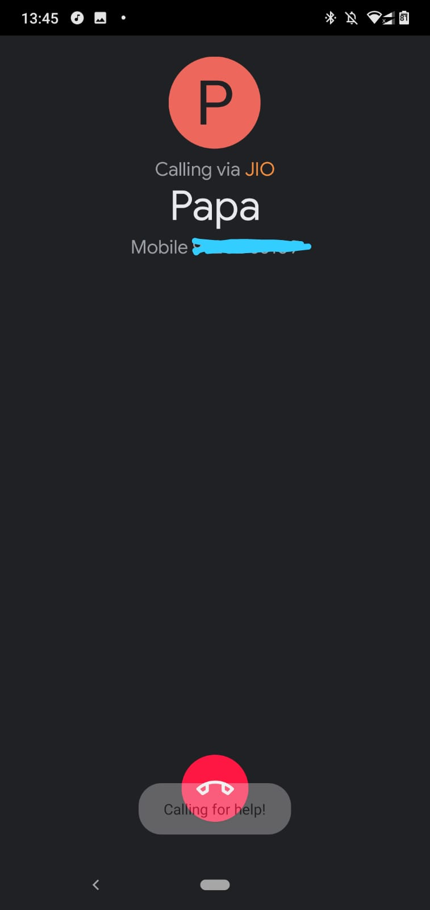

<h1 align="center">:man_cartwheeling: Fall to Call Out Boys :calling:</h1>

 

 

---

<h2>Motivation:</h2>

Many old people tend to fall more than an average person every day. In today's generation, most of the grandparents are left under the service of either old-age homes or a house servant while their children and grandchildren are busy in their daily work outside house. Hence, it becomes important for the family members to be able to take care of their elderly in a remote fashion. This Android App was developed with this goal in mind. This app can notify the emergency contact about any potential fall of the elderly. The app makes use of accelerometer and gyroscope readings to detect a fall. As soon as a spike in the readings is observed, the app automatically places a phone call to the emergency contact, asking for help. 

The use case of this application can also be extended to workplaces where worker's safety is a major concern. For eg: oil fields, coal mines, drainage cleaning, etc. In such cases, the app can notify the team about any haphazard situation they might have fallen into. 

### Features:

* [x] Set Emergency Contact feature. 
* [x] History tracking of past falls. Can be utilized by doctors to see patients' fall tendency patterns. 
* [x] Real-time accelerometer and gyroscope readings are plotted as a graph. 
* [x] Immediately calls the emergency contact on sharp spike in reading. 

---

<h3 align="center">Fall to Call out Boys as a Android App:</h3>

<h4 align="center">Homepage</h4>

 
<h4 align="center">Set Emergency Contact</h4>

 
<h4 align="center">Fall history</h4>

 
<h4 align="center">Real-time Sensor Data Graph Plot</h4>

 
<h4 align="center">Call being made to emergency contact</h4>

 
 

---

### Future scope of this project:

* [ ] Incorporate "ask user for permission" to allow the app to call. As of now, you need to set the permissions explicitly. 
* [ ] Send SMS Feature to notify about location and battery information. 
* [ ] Allow emergency contact to query about certain disclosable information through SMS. 
* [ ] Apply Time Series Prediction to determine a fall tendency pattern of particular user.
* [ ] Set off a loud beep in case a user is falling.  
* [ ] Give user the option to label if he/she really fell down or if it was a false fall detection. 

### Tech Stack of this Project:

* Frontend: XML
* Backend: Java
* Platform: Android

#### This project still has scope of development, so you can also contribute to this Project as follows:
* [Fork](https://github.com/arghyadeep99/Fall-to-Call-Out-Boys) this Repository.
* Clone your Fork on a different branch:
	* `git clone -b <name-of-branch> https://github.com/arghyadeep99/Fall-to-Call-Out-Boys.git`
* After adding any feature:
	* Goto your fork and create a pull request.
	* We will test your modifications and merge changes.

<b> This project was done as a submission for our Mobile Communications and Ad-Hoc Networks (MCAN) course. </b>

---

<h3 align="center"><b>Developed with :heart: by <a href="https://github.com/arghyadeep99">Arghyadeep Das</a>, <a href="https://github.com/soham-gadhave">Soham Gadhave</a> and <a href="https://github.com/Dhruv1501">Dhruv Desai</a>.</b></h1>

